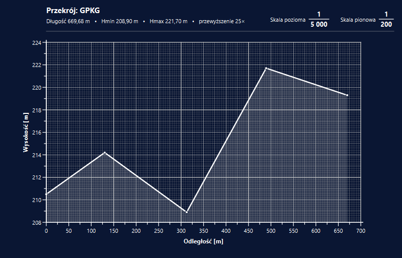

<p align="center">
  
</p>

<h1 align="center">Syrop Wykreślny</h1>

<p align="center">
  <b>Terrain cross-sections (profiles) from 3D lines – drawn to scale on millimetre graph paper, ready to print and to use in CAD.</b><br>
  Windows 10 / 11 application · QGIS script version · GPL-3.0
</p>

<p align="center">
  <a href="README.md">🇵🇱 Polski</a> · 🇬🇧 English
</p>

---



> The program's user interface is in Polish. The name is a Polish pun: *syrop wykrztuśny*
> (expectorant cough syrup) crossed with *wykreślić* – "to plot".

## What it does

Syrop Wykreślny reads a 3D line or multiline (Z coordinate = elevation) and draws its profile:
distance along the line on the horizontal axis and elevation on the vertical axis. The drawing is
laid out on "millimetre paper" at the chosen scales, so a printout at 100 % matches the scales in
the header.

- **Input:** KML/KMZ, DXF, DWG, SHP, GPKG in EPSG:4326 (WGS 84), 2176, 2177, 2178, 2179
  (Polish PL-2000 zones) and 2180 (PL-1992). The CRS is detected from the file or picked from a list.
- **Scales:** separate horizontal and vertical scales (e.g. 1:5,000 / 1:200), automatic vertical
  exaggeration, axis units mm / cm / m / km.
- **View:** millimetre grid on a navy background, mouse-wheel zoom, panning, distance and elevation
  readout under the cursor, editable header (title, data line, scale captions).
- **Sheet and printing:** A0–A6 or custom sheet size, orientation, margins, drag the sheet with the
  mouse, print to a printer or to PDF (white background) or in the on-screen colours.
- **Image:** copy the whole profile to the clipboard, save as PNG / JPEG / TIFF.
- **Export:** DXF, DWG, DGN (MicroStation v7), SHP, GPKG, KML
  - in a **local** coordinate system – a 1:1 copy of the on-screen drawing (profile origin = 0,0),
    with axes, grid, labels and sheet frame, each element on its own layer,
  - in a **georeferenced** CRS (EPSG 4326 / 2176–2180) – the section line as a 3D polyline with
    vertex labels (in DWG written without ODA File Converter: as a chain of 3D line segments).
- **AutoCAD:** DXF and DWG files open in any modern AutoCAD (also ZWCAD, BricsCAD). Labels are
  TEXT entities (Arial). SHP and GPKG exports include a label style for QGIS.

DWG support is built in (**LibreDWG** converter). If the free
[ODA File Converter](https://www.opendesign.com/guestfiles/oda_file_converter) is installed, the
program uses it automatically (DWG written as AutoCAD 2018), but it is not required.

## Download and installation

Ready-to-use files are on the **[Releases](../../releases/latest)** page:

| File | Description |
|---|---|
| `SyropWykreslny_<version>_instalator.exe` | Installer (Start menu, optional desktop shortcut, uninstaller). **No administrator rights needed.** |
| `SyropWykreslny_<version>_przenosny.zip` | Portable version – extract the whole folder (e.g. to a USB stick) and run `SyropWykreslny.exe`. |

Requirements: Windows 10 or 11, 64-bit. No Python, QGIS or other software needed.

> The program is not code-signed, so on first launch Windows may show "Windows protected your PC".
> Click **More info → Run anyway**.

## How to use

1. Start the program and choose a file with a line (or drag it onto the window). The file can also
   be passed on the command line: `SyropWykreslny.exe path\to\line.kml`.
2. Pick a line (or "all lines as one section") and check the coordinate system.
3. Click **Rysuj przekrój** (*Draw section*). In the section window set scales, units and header.
4. Use **Kopiuj jako obraz** (*Copy as image*), **Zapisz obraz…** (*Save image*), **Drukuj…**
   (*Print*) or **Eksportuj…** (*Export*). **Nowy przekrój…** (*New section*) opens another file in
   a new window.

Error log: `%LOCALAPPDATA%\SyropWykreslny\syrop_wykreslny.log`.

## QGIS version

The [`qgis/`](qgis/) folder contains the original script for **QGIS 4.x** (also works in 3.x).
Run it via *Plugins → Python Console → Show Editor → Open Script… → Run Script*. After the first
run a bottle icon appears on the plugins toolbar. In this version, reading and writing newer DWG
files requires the ODA File Converter.

## Building from source

All you need is Windows 10/11 with internet access – Python and the build tools are downloaded
automatically into `%LOCALAPPDATA%\SyropWykreslny-build` (nothing is installed system-wide).

1. Get the repository (**Code → Download ZIP** or `git clone`).
2. Run **`BUDUJ.bat`** (*build*).
3. After a few minutes the `wynik\` (*output*) folder contains the installer, the portable ZIP,
   a full package and automated test reports (`test_programu*.txt`).

The build script (`build/build.ps1`) downloads Python 3.12 (via [uv](https://github.com/astral-sh/uv)),
PyQt6, GDAL, ezdxf, GeographicLib, PyInstaller, LibreDWG and Inno Setup, runs the program's
self-tests (including in a folder with Polish characters in its path), and builds the exe, the
installer and the packages.

Running without building (with the packages installed):
```
pip install PyQt6 gdal ezdxf geographiclib
python src/syrop_wykreslny.py
```

## Repository layout

```
src/syrop_wykreslny.py      the program (Python, PyQt6 + GDAL)
qgis/                       QGIS script version
build/                      build script, Inno Setup installer, icon, version info
BUDUJ.bat                   starts the build
licenses/                   license texts of components (LGPL, Apache)
THIRD_PARTY_LICENSES.md     list of bundled components and their licenses
LICENSE                     program license (GNU GPL v3)
```

## License

Copyright © 2026 Michał Maciąg

This program is free software licensed under the **GNU General Public License, version 3 or (at
your option) any later version** ([`LICENSE`](LICENSE)). You may use it (commercially, too), copy,
modify and distribute it, provided that derived versions are also licensed under the GPL and come
with their source code. The program is provided **without any warranty**.

The GPL follows from the components used: PyQt6 and LibreDWG are licensed under GPL-3.0.
All components and their licenses are listed in
[`THIRD_PARTY_LICENSES.md`](THIRD_PARTY_LICENSES.md).
